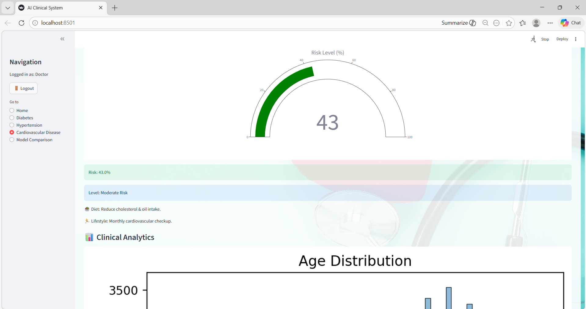
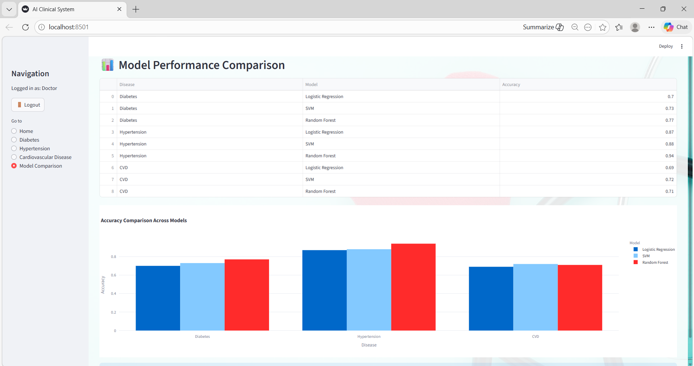

# 🧠 AI-Based Early Risk Detection Using Clinical Data

## 📌 Project Overview

This project focuses on **predicting early health risks using machine learning models** trained on clinical datasets.
It analyzes patient medical data to detect possible risks related to diseases such as:

* Hypertension
* Diabetes
* Cardiovascular Disease (CVD)

The system now includes a **Django REST API backend** and a **React/Vite frontend** for clinical data entry and real-time prediction with SHAP explainability.

---

## 🗂 Project Structure

```
AI-Based-Early-Risk-Detection-Using-Clinical-Data/
├── backend/                 # Django REST API
│   ├── backend/             # Django project settings & urls
│   ├── api/                 # DRF app (models, views, serializers, predictor)
│   │   ├── models.py        # Patient + HealthRecord models
│   │   ├── serializers.py
│   │   ├── views.py
│   │   ├── urls.py
│   │   ├── cvd_predictor.py # ML inference + SHAP
│   │   └── migrations/
│   ├── manage.py
│   └── requirements.txt
├── frontend/                # Vite + React frontend
│   ├── src/
│   │   ├── api/client.js    # Axios client
│   │   ├── pages/
│   │   │   ├── AddPatient.jsx
│   │   │   ├── AddHealthRecord.jsx
│   │   │   ├── PatientHistory.jsx
│   │   │   └── Prediction.jsx
│   │   ├── App.jsx
│   │   └── main.jsx
│   ├── .env.example
│   └── package.json
├── cvd/                     # CVD dataset & trained model
├── diabetes/                # Diabetes dataset
├── Hypertension/            # Hypertension dataset
├── ml/                      # Original predictor script
├── modules/                 # Shared utility modules
└── README.md
```

---

## 🚀 Backend Setup (Django REST API)

### Prerequisites
- Python 3.10+
- CVD model files in `cvd/cvd_model.pkl` and `cvd/feature_columns.pkl`

### 1. Install dependencies

```bash
cd backend
pip install -r requirements.txt
```

### 2. Apply migrations

```bash
python manage.py migrate
```

### 3. Start the server

```bash
python manage.py runserver
```

The API will be available at `http://localhost:8000/api/`.

### API Endpoints

| Method | URL | Description |
|--------|-----|-------------|
| POST | `/api/patients/` | Create a patient |
| GET | `/api/patients/` | List all patients |
| POST | `/api/patients/{id}/records/` | Add a health record |
| GET | `/api/patients/{id}/records/` | Get patient's records |
| POST | `/api/patients/{id}/predict/` | Run CVD prediction + SHAP |

### Environment Variables (optional)

| Variable | Default | Description |
|----------|---------|-------------|
| `DJANGO_SECRET_KEY` | insecure dev key | Django secret key |
| `DJANGO_DEBUG` | `True` | Enable debug mode |
| `DJANGO_ALLOWED_HOSTS` | `localhost 127.0.0.1` | Allowed hosts |
| `CVD_MODEL_PATH` | `../cvd/cvd_model.pkl` | Path to ML model |
| `CVD_BACKGROUND_CSV` | `../cvd/cleaned_cardio_data.csv` | SHAP background data |

---

## 🌐 Frontend Setup (Vite + React)

### Prerequisites
- Node.js 18+

### 1. Install dependencies

```bash
cd frontend
npm install
```

### 2. Configure API URL

```bash
cp .env.example .env
# Edit .env if your backend runs on a different port:
# VITE_API_BASE_URL=http://localhost:8000/api
```

### 3. Start development server

```bash
npm run dev
```

The frontend will be available at `http://localhost:5173`.

### Pages

| Route | Page | Description |
|-------|------|-------------|
| `/` | Add Patient | Register a new patient |
| `/records` | Add Health Record | Add a health measurement |
| `/history` | Patient History | Table + BP/Cholesterol trend charts |
| `/predict` | Prediction | CVD risk prediction + SHAP explanation |

---

## 📊 Dashboard Preview





---

## 🛠 Technologies Used

* Python, Django, Django REST Framework
* React 18, Vite, React Router, Axios, Recharts
* scikit-learn, SHAP, pandas, numpy, joblib
* SQLite (dev)

---

## ⚠ Note

Large trained model files (`.pkl`) are excluded from the repository due to GitHub file size limitations.
Place `cvd_model.pkl` and `feature_columns.pkl` in the `cvd/` directory before running the backend.

---

## 👩‍💻 Author

Garima Sharma  
BCA – Artificial Intelligence & Data Science  
K.R. Mangalam University


## 📌 Project Overview

This project focuses on **predicting early health risks using machine learning models** trained on clinical datasets.
It analyzes patient medical data to detect possible risks related to diseases such as:

* Hypertension
* Diabetes
* Cardiovascular Disease (CVD)

The system provides insights through a **clinical dashboard** that helps visualize predictions and analysis.

---

## 🎯 Objectives

* Detect potential health risks at an early stage
* Apply machine learning techniques to healthcare data
* Perform exploratory data analysis on clinical datasets
* Provide a simple dashboard interface for predictions

---

## 🛠 Technologies Used

* Python
* Pandas
* NumPy
* Scikit-learn
* Matplotlib
* Seaborn
* Jupyter Notebook

---

## 📂 Project Structure

AI-Based-Early-Risk-Detection-Using-Clinical-Data

cvd/ → Cardiovascular disease dataset and analysis

diabetes/ → Diabetes prediction dataset and notebooks

Hypertension/ → Hypertension dataset and machine learning model

modules/ → Utility scripts for analysis and visualization

final_clinical_dashboard.py → Main dashboard application

README.md → Project documentation

.gitignore → Files excluded from Git tracking

---

## 📊 Features

* Exploratory Data Analysis (EDA)
* Machine Learning Model Training
* Disease Risk Prediction
* Clinical Dashboard Interface
* Multiple disease analysis

---

## ▶ How to Run the Project

### 1️⃣ Clone the repository

git clone https://github.com/assistansirit2255/AI-Based-Early-Risk-Detection-Using-Clinical-Data.git

### 2️⃣ Navigate to the project folder

cd AI-Based-Early-Risk-Detection-Using-Clinical-Data

### 3️⃣ Install required libraries

pip install pandas numpy scikit-learn matplotlib seaborn streamlit

### 4️⃣ Run the dashboard

python final_clinical_dashboard.py

---

## 📊 Dashboard Preview


---

## ⚠ Note

Large trained model files (.pkl) are excluded from the repository due to GitHub file size limitations.

---

## 🚀 Future Improvements

* Deploy dashboard using Streamlit Cloud
* Integrate real-time patient data
* Improve prediction accuracy using advanced ML models
* Add interactive healthcare visualizations

---

## 👩‍💻 Author

Garima Sharma

BCA – Artificial Intelligence & Data Science

K.R. Mangalam University
