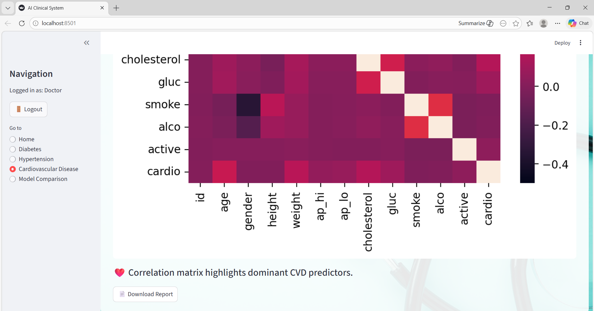

# 🧠 AI-Based Early Risk Detection Using Clinical Data

## 📌 Project Overview

This project focuses on **predicting early health risks using machine learning models** trained on clinical datasets.
It analyzes patient medical data to detect possible risks related to diseases such as:

* Hypertension
* Diabetes
* Cardiovascular Disease (CVD)

The system provides insights through a **clinical dashboard** that helps visualize predictions and analysis.

---

## 🎯 Objectives

* Detect potential health risks at an early stage
* Apply machine learning techniques to healthcare data
* Perform exploratory data analysis on clinical datasets
* Provide a simple dashboard interface for predictions

---

## 🛠 Technologies Used

* Python
* Pandas
* NumPy
* Scikit-learn
* Matplotlib
* Seaborn
* Jupyter Notebook

---

## 📂 Project Structure

AI-Based-Early-Risk-Detection-Using-Clinical-Data

cvd/ → Cardiovascular disease dataset and analysis

diabetes/ → Diabetes prediction dataset and notebooks

Hypertension/ → Hypertension dataset and machine learning model

modules/ → Utility scripts for analysis and visualization

final_clinical_dashboard.py → Main dashboard application

README.md → Project documentation

.gitignore → Files excluded from Git tracking

---

## 📊 Features

* Exploratory Data Analysis (EDA)
* Machine Learning Model Training
* Disease Risk Prediction
* Clinical Dashboard Interface
* Multiple disease analysis

---

## ▶ How to Run the Project

### 1️⃣ Clone the repository

git clone https://github.com/assistansirit2255/AI-Based-Early-Risk-Detection-Using-Clinical-Data.git

### 2️⃣ Navigate to the project folder

cd AI-Based-Early-Risk-Detection-Using-Clinical-Data

### 3️⃣ Install required libraries

pip install pandas numpy scikit-learn matplotlib seaborn streamlit

### 4️⃣ Run the dashboard

python final_clinical_dashboard.py

---

## 📊 Dashboard Preview

(Add your dashboard screenshot here)

Example:

---

## ⚠ Note

Large trained model files (.pkl) are excluded from the repository due to GitHub file size limitations.

---

## 🚀 Future Improvements

* Deploy dashboard using Streamlit Cloud
* Integrate real-time patient data
* Improve prediction accuracy using advanced ML models
* Add interactive healthcare visualizations

---

## 👩‍💻 Author

Garima Sharma

BCA – Artificial Intelligence & Data Science

K.R. Mangalam University
